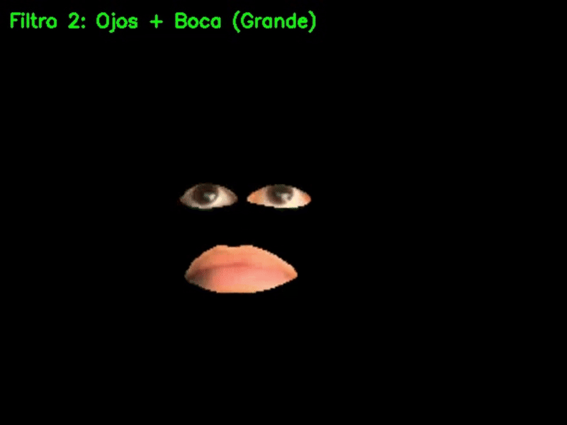

# Práctica 5. Detección y caracterización de caras

**Autor:** Eduardo Gainza Koller  
**Asignatura:** Visión por Computador  
**Fecha:** Noviembre 2024

## Descripción General

Este proyecto implementa un sistema de visión artificial dividido en dos módulos principales de procesamiento facial en tiempo real. El objetivo es explorar tanto las técnicas de *Deep Learning* para la clasificación de estados afectivos como el uso de geometría computacional para la manipulación de imágenes basada en puntos de referencia (*landmarks*).

El sistema ha sido desarrollado en Python y se ejecuta sobre flujos de vídeo en directo (Webcam), integrando detección facial, clasificación mediante Redes Neuronales Convolucionales (CNN) y realidad aumentada simple.

---

## Tarea 1: Identificación de Emociones y Filtros Dinámicos

Esta tarea se centra en la creación de un modelo capaz de inferir el estado emocional del usuario y responder visualmente acorde a la predicción.

### 1. Modelo de Deep Learning (CNN)
Se ha diseñado y entrenado una Red Neuronal Convolucional utilizando la librería **Keras/TensorFlow**. El modelo procesa imágenes en escala de grises redimensionadas a $48 \times 48$ píxeles.

**Arquitectura del Modelo:**
* **Entrada:** Tensor de dimensiones $(48, 48, 1)$.
* **Extracción de características:** Tres bloques convolucionales (`Conv2D`) con funciones de activación *ReLU*, seguidos de capas de `MaxPooling2D` para reducir la dimensionalidad espacial.
* **Clasificación:** Una capa `Flatten` seguida de una capa densa (`Dense`) de 128 neuronas con regularización `Dropout` del 50% para evitar el sobreajuste.
* **Salida:** Capa `Dense` con activación *Softmax* para 5 clases: *Angry, Fear, Happy, Sad, Surprise*.

Los resultados del entreno del modelo se muestran a continuación:

              precision    recall  f1-score   support

       Angry       0.56      0.67      0.61      1016
        Fear       0.55      0.36      0.44       974
       Happy       0.88      0.87      0.87      1845
         Sad       0.59      0.65      0.62      1256
    Surprise       0.74      0.77      0.76       824

    accuracy                           0.69      5915

  Matriz de confusión sin normalizar

Matriz de confusión normalizada

### 2. Aplicación de Filtros por Emoción
El sistema utiliza **MTCNN** para la detección del rostro. Una vez clasificada la emoción, se aplican efectos visuales mediante la función personalizada `overlay_image_alpha` y sistemas de partículas:

* **Happy:** Superposición de un halo dorado y generación de partículas de colores dinámicas.
* **Sad:** Detección de la posición de los ojos para superponer lágrimas (`tear_png`) y aplicación de un filtro de color melancólico.
* **Angry:** Superposición de un aura de fuego o filtro rojo intenso sobre la región facial.
* **Surprise:** Efecto visual de enfoque y partículas blancas de "shock".
* **Neutral:** Aplicación de un filtro bilateral para suavizar la piel del rostro sin alterar la geometría.

### 3. Resultados
A continuación se muestra una pequeña demo de la ejecución:

*[Si el video no se reproduce, puede descargarlo o visualizarlo directamente aquí](emociones.mp4)*

---

## Tarea 2: Filtro Geométrico con MediaPipe

La segunda parte del proyecto prescinde del aprendizaje profundo para centrarse en la manipulación geométrica utilizando la malla facial de **Google MediaPipe**.

### 1. Extracción de Landmarks
Se utiliza la solución `FaceMesh` de MediaPipe para obtener en tiempo real una malla de 468 puntos tridimensionales del rostro. Esto permite localizar con alta precisión regiones anatómicas específicas sin depender de las condiciones de iluminación o la pose del sujeto.

### 2. Lógica del Filtro de Caricatura
El algoritmo implementado realiza una deformación selectiva de las facciones del usuario:

1.  **Segmentación:** Se definen los índices de los *landmarks* correspondientes al ojo izquierdo, ojo derecho y el contorno exterior de la boca.
2.  **Enmascarado:** Se generan máscaras binarias convexas para recortar estas regiones específicas del flujo de vídeo original.
3.  **Transformación:** Las regiones extraídas (ojos y boca) se escalan con un factor de ampliación (x1.8) para generar un efecto cómico.
4.  **Composición:** Las partes agrandadas se superponen nuevamente sobre el lienzo.

El sistema permite alternar entre dos visualizaciones:
* **Filtro 1 (Aislado):** Muestra únicamente los rasgos agrandados sobre un fondo negro.
* **Filtro 2 (Integrado):** Superpone los rasgos transformados sobre el rostro original del usuario en tiempo real.

### 3. Resultados
A continuación se muestra una pequeña demo de la ejecución:

*[Si el video no se reproduce, puede descargarlo o visualizarlo directamente aquí](filtro_demo.mp4)*

---

## Requisitos e Instalación

Para ejecutar el *notebook* adjunto (`VC_P5_EGK.ipynb`), es necesario disponer de las siguientes dependencias:

* Python 3.x
* TensorFlow / Keras
* OpenCV (`opencv-python`)
* MediaPipe
* MTCNN
* NumPy, Matplotlib, Scikit-learn
